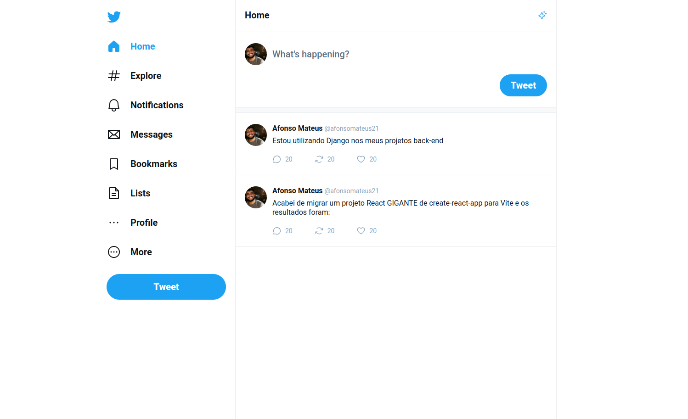
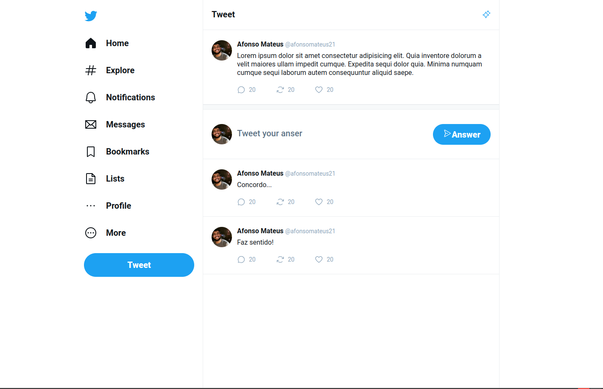
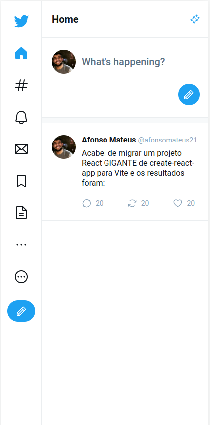
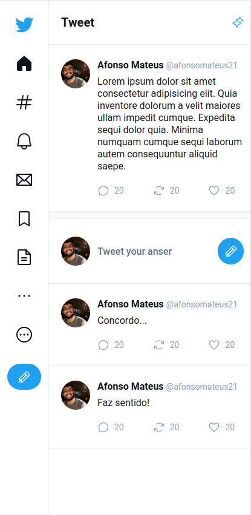

# UI-Twitter
## Clone da interface do Twitter utilizando ReactJS

# 💻 Sobre
Este projeto consiste no clone da interface do Twitter. Ele tem como objetivo 
melhorar minhas habilidades com estilização utilizando styled-components. Também 
utilizei o Vite como inicializador de projeto.

# Funcionalidades
- [x] Cadastro de novo tweet
- [x] Resposta de tweet
- [x] Navegação entre telas utilizando ReactRouter

# 🎨 Layout
### Web



### Mobile



# Instalação
### Pré requisitos
Certifique-se de ter o [Node](https://nodejs.org/en/) e o [Git](https://git-scm.com) instalados, além de um gerenciador
de pacotes como o [Yarn](https://yarnpkg.com/) ou o [NPM](https://www.npmjs.com/).

### 🎨 Execução
```bash
# Clone o repositório
$ git clone <https://github.com/afonsomateus21/ui-twitter.git> ou
$ git clone <git@github.com:afonsomateus21/ui-twitter.git> se utilizar SSH

# Instale as dependências
$ npm install ou yarn install

# Execute a aplicação em modo de desenvolvimento
$ npm dev ou yarn dev

# O aplicação ficará disponível na porta:5173 - acesse <http://localhost:5173>
```

# 🛠 Tecnologias
As seguintes tecnologias foram utilizadas na construção do projeto:
- [TypeScript](https://www.typescriptlang.org/)
- [ReactRouter](https://reactrouter.com/en/main)
- [StyledComponents](https://styled-components.com/)

# Autor
Afonso Mateus<br/>
<a href="https://www.linkedin.com/in/afonso-mateus-3a8522118/"></a>


# Licença
Este projeto está sob a licença [MIT](https://github.com/afonsomateus21/ui-twitter/blob/main/LICENSE)

Feito com ❤️ por Afonso Mateus 👋 [Entre em contato!](https://www.linkedin.com/in/afonso-mateus-3a8522118/)
